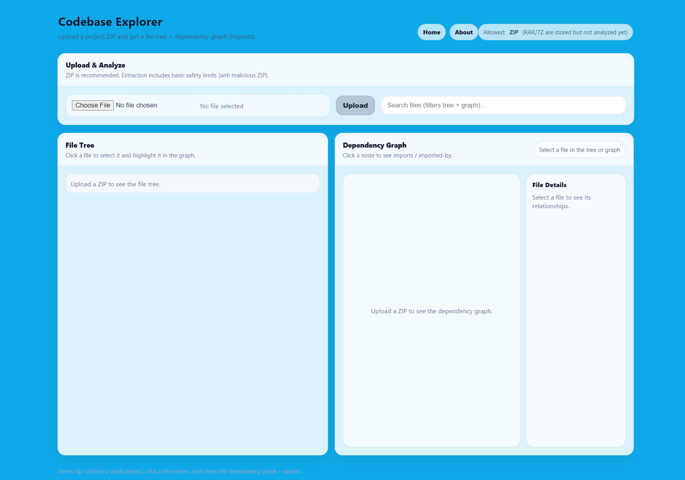
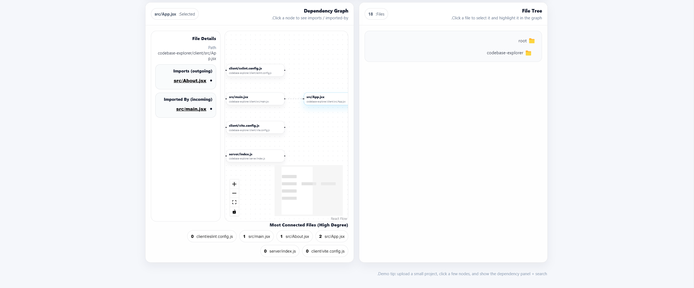

# Codebase Explorer 🔍

A visual tool for exploring a codebase by uploading a ZIP archive and generating:

-  A hierarchical file tree  
-  An interactive dependency graph (imports)

Built as a **personal project** to demonstrate full-stack skills, system thinking, and product-oriented development.

---

##  What does it do?

1. Upload a project as a ZIP file  
2. Securely extracts the archive on the server  
3. Analyzes the codebase structure  
4. Generates:
   - File tree view
   - Import dependency graph (JavaScript / TypeScript)
5. Enables:
   - File search
   - Selecting a file to highlight its dependencies
   - Viewing `imports` and `imported by` relationships

---

##  Why is this useful?

- Quickly understand an unfamiliar codebase
- Identify central / high-impact files
- Visualize architecture and module relationships
- Useful for onboarding, refactoring, and code reviews

---

##  Tech Stack

### Backend
- Node.js
- Express
- Multer (file uploads)
- unzipper (ZIP extraction)
- Static import analysis (JS / TS)

### Frontend
- React
- React Flow (graph visualization)
- Dagre (graph layout)
- React Router (navigation + About page)

---

##  Security & Stability

The server includes basic safety measures:
- Protection against Zip Slip attacks
- Limits on extracted file size and count
- Automatic cleanup of temporary files (TTL)
- Common folders ignored (`node_modules`, `dist`, `build`, etc.)

---

## Known Limitations for now

- Full analysis is supported **only for ZIP files**
  - RAR / 7Z are accepted but not extracted yet
- The dependency graph is based on **local imports only** (`./`, `../`)
- Very large projects may result in a dense graph

---
## 📸 Screenshots




##  Running Locally

### Server / Client
```bash
cd server
npm install
npm run dev


cd client
npm install
npm run dev


